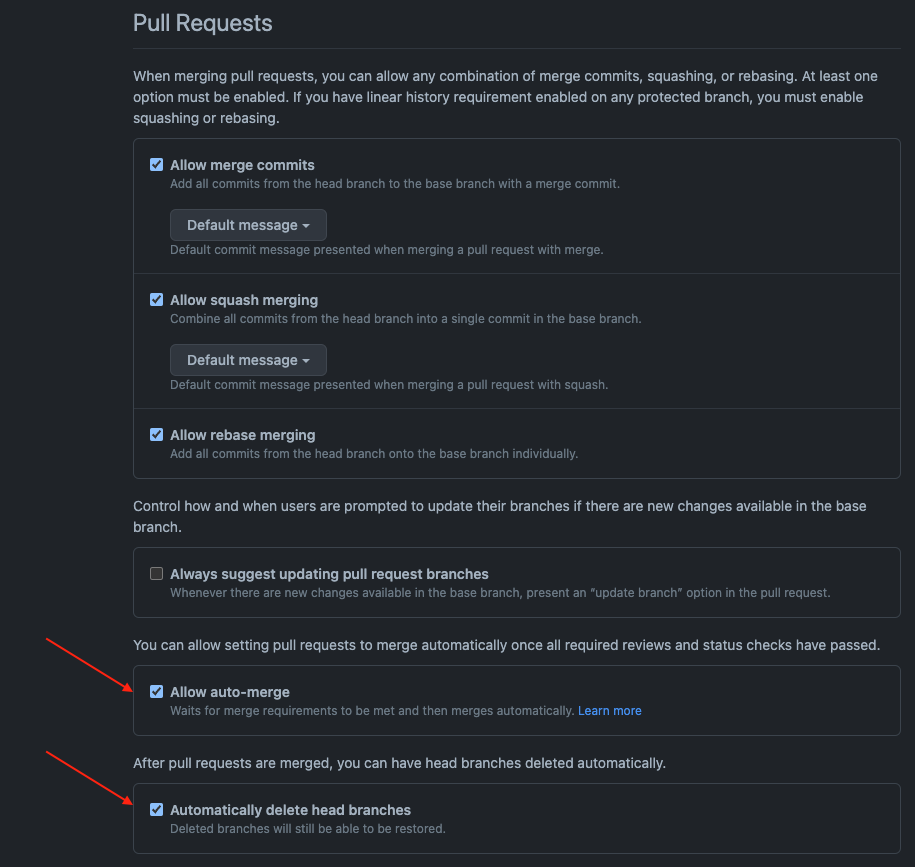
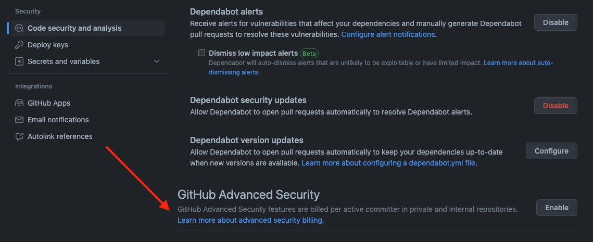
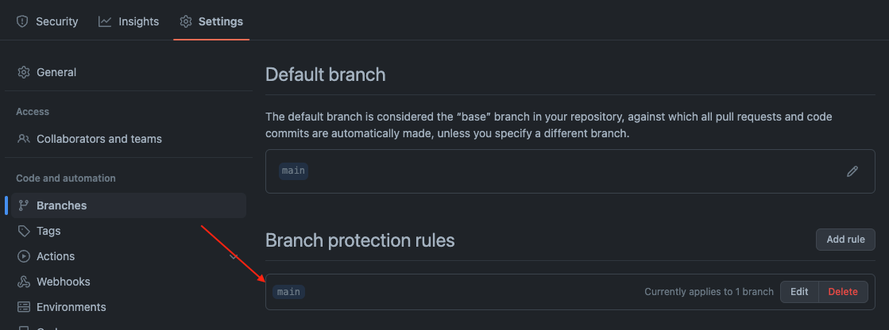
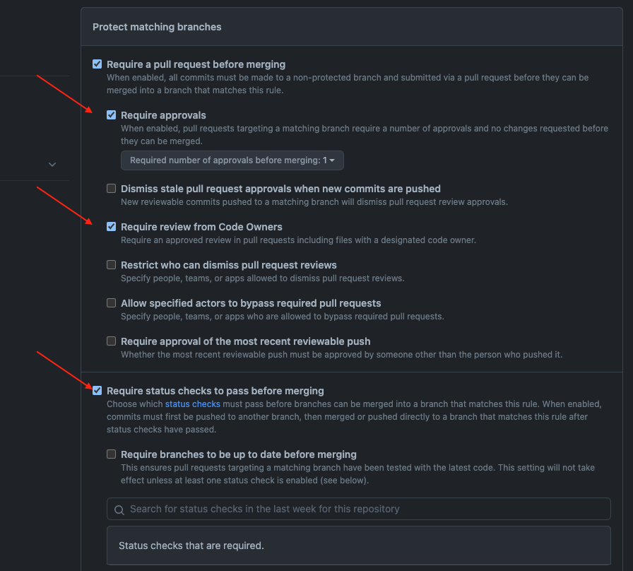

# os-app-template

| **Type** | **Status**                                                                                                                                                             |
|----------|------------------------------------------------------------------------------------------------------------------------------------------------------------------------|
| Release  | [](https://github.com/sumup/os-app-template/actions/workflows/release.yml) |

## Setup

Located in `./bin/init.sh`. Simply run and follow the explanation how to
execute it. This script will self-destroy itself when finished.

Moreover, you need to setup the following configurations on your repository:

- Add branch protection to your `main` branch.
- Add the following as collaborators to the repository with the required access:

| **User**                        | **Access** | **Notes**                                                                                                                                                                                                                                         |
|---------------------------------|------------|---------------------------------------------------------------------------------------------------------------------------------------------------------------------------------------------------------------------------------------------------|
| @sumup/squad-os_operate-backend | Admin      | can be replaced with any other code owners for this repository                                                                                                                                                                                    |
| @os-engineering-bot             | Write      | Make sure to accept the invite from the user, (credentials can be found at [our team vault](https://start.1password.com/open/i?a=MQZRBHML3ZCG3D2CKWGCFMNHMQ&v=7wj54r4656vip3ttzya6sqsqp4&i=p3usisl3mqrcx7bwbiifhrfria&h=team-sumup.1password.eu)) |
| @sumup/sumup-developers         | Write      |                                                                                                                                                                                                                                                   |

- If needed, update the code owners of the repository
- Add the following secrets to the repository inside `Actions` tab
  (all values can be found in the vault mentioned above):
    - `PACKAGES_TOKEN` (repository and write:packages)
    - `REVIEWER_TOKEN` (repository and read:packages, repo)
- Add `REVIEWER_TOKEN` secret inside `dependabot` tab as well, otherwise
  PRs opened by dependabot will fail as they would not be able checking out our
  `composite-actions` code.


- Enable `auto-merge` and `Automatically delete head branches` in
  the repository so `depednabot` could automatically merge successful PRs.



- Enable GitHub Advanced Security



- Setup Branch protection rule





- Open a PR in [terraform-ecr](https://github.com/sumup/terraform-ecr) for the
  new service, so it can be published to ECR. You can see [this](https://github.com/sumup/terraform-ecr/pull/477)
  PR as an example. And send it to [#kanal](https://sumup.slack.com/archives/C4UUSAS68)

- Add your application to `ArgoCD` by following the
  instructions [here](https://github.com/sumup/deploy-infra/tree/master/management#want-to-add-an-app-to-the-default-trifecta-of-clusters-theta-stage-live).
  Remember to create PR if you push to directly to master it doesn't work!
  If you want to disable auto sync use `autosync(fleet.live, false)`.

- Create setup for fleet in `deploy-infra` for your service (You can see
  [this](https://github.com/sumup/deploy-infra/pull/40561) PR as an example).

- To add database you need to create PR similar to [this one](https://github.com/sumup/fleet/pull/2550)

## Getting Started

These instructions will get you a copy of the project up and running on your
local machine for development and testing purposes. See deployment for notes on
how to deploy the project on a live system.

### Prerequisites

To run the project you need to install the following:

- JDK 17 or newer
- Docker

### Building the application

The project uses [Gradle](https://gradle.org) as a build tool. It already contains
`./gradlew` wrapper script, so there's no need to install gradle.

To build the project execute the following command:

```shell
  ./gradlew build
```

### Running the application

Create the image of the application by executing the following command:

```shell
  ./gradlew assemble
```

You can run this project directly from Gradle by executing the following
command:

```shell
./gradlew bootRun
```

Otherwise, you can create docker image:

```shell
  docker-compose build
```

For Apple M1 processor run the following instead:

```shell
DOCKER_BUILDKIT=0 docker-compose build
```

Run the distribution (created in `os-app-template/build/install/os-app-template`
directory) by executing the following command:

```shell
  docker-compose up && ./gradlew bootRun
```

This will start the API container exposing the application's port
(set to `8080` in this app).

In order to test if the application is up, you can call its health endpoint:

```shell
  curl http://localhost:8080/actuator/health
```

You should get a response similar to this:

```json
  {
  "status": "UP",
  "diskSpace": {
    "status": "UP",
    "total": 249644974080,
    "free": 137188298752,
    "threshold": 10485760
  }
}
```

### Alternative script to run application

To skip all the setting up and building, just execute the following command:

```shell
./bin/run-in-docker.sh
```

For more information:

```shell
./bin/run-in-docker.sh --help
```

## Running the tests

You can run the project tests via Gradle by executing the following command:

```shell
./gradlew test
```

### And coding style tests

This project uses [Spotless Gradle plugin](https://github.com/diffplug/spotless)
to enforce its code style. The plugin will run automatically after every
successful build, test, and assemble stage. However, if you would like to run
it manually you can do so by running the following commands:

To apply the code style to the project run:

```shell
./gradlew spotlessApply
```

To check your code without applying any changes you can execute:

```shell
./gradlew spotlessCheck
```

## Api Documentation

The service exposes it's API specification in the following URL:
[swagger-ui/index.html](http://localhost:8080/swagger-ui/index.html).

You can also fetch the information in JSON ([api-docs](http://localhost:8080/api-docs/))
or YAML ([api-docs.yaml](http://localhost:8080/api-docs.yaml)) formats.

The API requires the `x-sumup-authorization` header which have the following
structure:

```text
account_type=<ACCOUNT_TYPE>&userid=<USER_ID>&merchant_code=<MERCHANT_CODE>&merchant_id=<MERCHANT_ID>
```

for example:

```text
account_type=normal&userid=28&merchant_code=MCXDUFTH&merchant_id=28
```

The `userId`, `merchant_id` could be found in SOAP, `poslite` database and the
`platform` database in the tables `merchants` and `users`.

the `account_type` can contain only 2 values:

- NORMAL (main account)
- OPERATOR (sub-account)

## Plugins

To read more about the plugins included in this project click
[here](docs/plugins.md).

## Built With

- [OpenJdk 17](https://openjdk.java.net/projects/jdk/17/)
- [Kotlin](https://kotlinlang.org/)
- [SpringBoot](https://spring.io/projects/spring-boot) - The web framework used
- [Gradle](https://gradle.org/) - Dependency Management
- [GitHub Actions](https://docs.github.com/en/actions) - Continuous Integration
- [Docker](https://www.docker.com/) - Container handling

## Versioning

We use [SemVer](http://semver.org/) for versioning. For the versions available,
see the [tags on this repository](https://github.com/your/project/tags).

## Deploy

In order to allow autodeploy we need create and add bot to auto deploy group.
[Example](https://github.com/sumup/github-settings/pull/2014)
